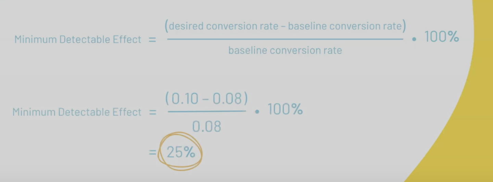

# Lesson 9, Buzzfeed
[[Excel]]
### Planning A/B Test 
A/B Testing: compare Multiple versions of the same variable, to see what performs better.
1. Figure out What yyou want to change
2. Develop a Null and Alternative Hypothesis (you may wanna write the allternative first as that is more intuitive)
3. Minimum Detectable Effect: Smallest change in performance that would make the implementing the change worth it 
Formula fofr MDE:

- statsig to calculate total sample size
- significance Value is the Probabilty that a statistically significant difference is detected, when no actual difference exists (determines if results are significant/ not random)
- Statistical power is the probability that a minimum detectable effect will be detected, assuming it exists
**[A/B Testing](https://www.loom.com/share/34bed5d84e494f9db50dda3c4f04020b?sid=03e1b429-3fd5-46b4-80b8-b655979e0e99)**
**[Client Intro](https://www.loom.com/share/ce8169f72d5a4b1d869b9d66398ed7fa?sid=8a767c3c-5ead-4e1e-b405-dcf6d2326ac3)**
**[Task 1-2](https://www.loom.com/share/3c9fa076979a4824bb68e4077c52d6cd?sid=24abfc2c-6f60-49b5-be23-73a251bcb3a3)**
**[Task 3-4](https://www.loom.com/share/9bdb4a00f9964923ad76fd9219beac0f?sid=ca9b97ab-c730-48c6-b734-7531003d52d2)**
### Doing A/B Test
I created a pivot table to analyze the control size and test size
**[re-intro](https://www.loom.com/share/6d3e2b56122d462091814a65f2d266d2?sid=0e9bc166-4a6d-4c91-93e2-43dfba230167)**
**[Task 1](https://www.loom.com/share/11f8c4299b0046a8b92dfc2df654ec56?sid=4e07f410-1bb8-4237-9ba1-218532977be1)**
**[Task 2](https://www.loom.com/share/16ae917b8a1e4a9ba165e1585ec06c4e?sid=2634c689-d267-41d3-89a7-ff6c0099bc98)**
**[Part 3](https://www.loom.com/share/81506854a1494a529eda72716c6b50e5?sid=9fc7547b-d24a-4979-9214-a91c3e72edd0)**

- 